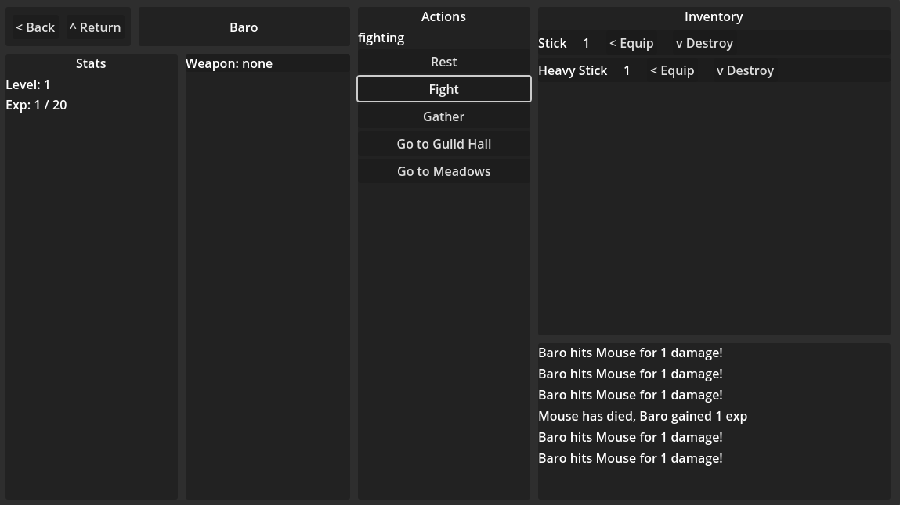

# Godot Prototypes

## Idle Text Adventure

Prototype for a text based idle game. Character can navigate to meadows and fight enemies or gather wood.

## Path Drawing
Early prototyping for a walking game concept. Rather than tracking position this prototype allowed drawing a path on a map image.

